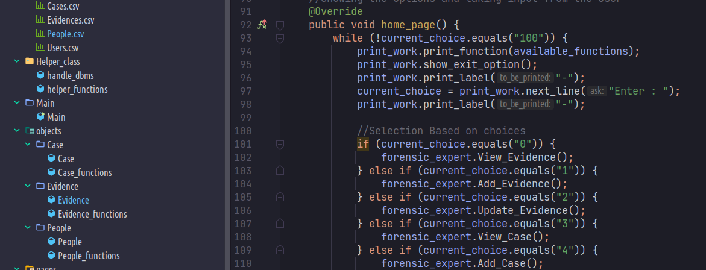

<h1 class="code-line" data-line-start=0 data-line-end=1 ><a id="Forensic_Management_System_0"></a>Forensic Management System</h1>




## Members 
#### [Aashraya Katiyar](https://github.com/Aashray446)
#### [Akshaj.S.R](https://github.com/Akshaj000)
#### Sai Sumitha
#### B Nandhana 
#### [Ronak Dudhani](https://github.com/ronakdudhani)
#### [Nikhil](https://github.com/NikhilSingh433)

### Directory tree
```
src
├── Database
│   ├── Cases.csv
│   ├── Evidences.csv
│   ├── People.csv
│   └── Users.csv
├── Helper_class
│   ├── handle_dbms.java
│   └── helper_functions.java
├── Main
│   └── Main.java
├── objects
│   ├── Case
│   │   ├── Case_functions.java
│   │   └── Case.java
│   ├── Evidence
│   │   ├── Evidence_functions.java
│   │   └── Evidence.java
│   └── People
│       ├── People_functions.java
│       └── People.java
├── pages
│   ├── Admin_page.java
│   ├── Forensic_page.java
│   ├── Login.java
│   ├── Page.java
│   └── Police_page.java
└── Users
    ├── Admin.java
    ├── ForensicExpert.java
    ├── Investigator.java
    └── User.java
```
<h2 class="code-line" data-line-start=12 data-line-end=13 ><a id="Database_Handling_Instruction_12"></a>Database Handling Instructions</h2>

<p class="has-line-data" data-line-start="14" data-line-end="19">We used .csv to store data in out system. There is a <strong>handle_dbms</strong> class in the Helper Class folder. You can create a instance of the class and have the following operations : - <br>
<strong>1</strong>. Object.write_to_file(Data as string, Filename as String)  <strong style="color:red;"><em> <br>[ Will add the data at the end of the file]</em></strong><br>
<strong>2</strong>. object.append(Data as string, Filename as String) <br> <strong><em>[ Will overwrite the file with the given data, mostly used for editing any kind of prev data]</em></strong><br>
<strong>3</strong>. object.read(Filename as String) <br> <strong><em>[Will return the data of csv file as ArrayList of type String object ]</em></strong><br>
<strong>3</strong>. object.convert_to_string(Filename as String) <strong><em> <br> [Will convert the ArrayList data back to CSV format i.e string, to be supplied to append ]</em></strong></p>

---
